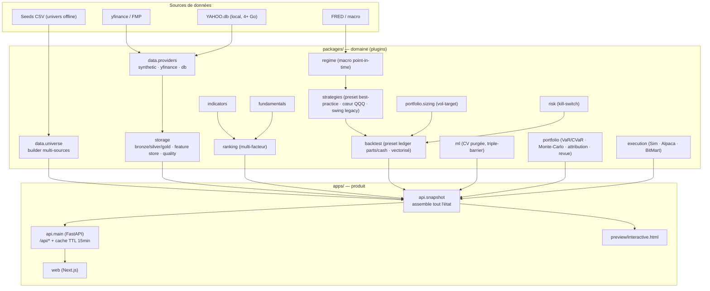

# Quant Terminal — le terminal quant qui publie ce qui **ne marche pas**

[](https://github.com/7noctis7/Screening-Trading/actions/workflows/ci.yml)
[](https://github.com/7noctis7/Screening-Trading/actions/workflows/pages.yml)
[](https://github.com/7noctis7/Screening-Trading/actions/workflows/gitleaks.yml)


> **La plupart des projets quant vendent un alpha imaginaire. Celui-ci prouve statistiquement
> ce qui ne marche pas — et le publie.** Screening & trading systématique multi-actifs (actions,
> ETF, forex, crypto, commodités), méthodologie niveau institutionnel (López de Prado), 100 %
> open-source, **infra 0 €**, **paper par défaut**.

**🌐 Démo live (Mac éteint, 0 €) :** **https://7noctis7.github.io/Screening-Trading/** — PWA Next.js
reconstruite chaque jour ouvré par GitHub Actions sur données réelles (yfinance / SEC EDGAR).

### Ce qui rend ce projet différent
- **🔬 Gate d'honnêteté à 4 étages** — aucune stratégie n'entre en prod sans passer *placebo →
  Deflated Sharpe → PBO/CSCV → sabotage adverse*. **8 hypothèses rejetées**, publiées dans le
  [**Registre des échecs**](https://7noctis7.github.io/Screening-Trading/echecs) (`packages/research/`).
- **📉 Edge honnête** : DSR≈0 assumé (pas d'alpha directionnel prouvé) — le seul edge vérifié est la
  **réduction du drawdown (~2,6×)**. On ne vend pas de rêve : donnée absente → `n/d`, jamais inventé.
- **🛡️ Rigueur anti-fuite** : point-in-time partout (vintages ALFRED réels, prix ajustés splits),
  purged/embargoed CV, verrous de non-régression testés (`packages/common/pit_guard.py`).
- **⚙️ Ingénierie** : **825 tests**, gate CI, ADRs, architecture en plugins (« 1 fichier, jamais
  toucher au cœur »), config-driven YAML. Voir [`vault/01_ARCHITECTURE.md`](vault/01_ARCHITECTURE.md)
  et l'**[étude de cas du Gate anti-fuite](docs/CASE_STUDY.md)**.
- **🤖 Exécution paper réelle** : réconciliation idempotente vers Alpaca (paper), journal des trades
  avec features figées à la décision + round-trip PnL/MFE/MAE → verdict GO/NO-GO **mécanique**
  (`make rdv-paper`).

> ⚠️ Aide à la décision — **pas un conseil en investissement**. Risque de perte en capital.
> Priorités : **robustesse & reproductibilité > risque > alpha > produit**.

---

## ✨ Le terminal en un coup d'œil

Fenêtres : **Dashboard** (perf vs benchmarks, régime, playbook VIX, screener+ML) ·
**Thèmes de marché** (heatmap YTD par secteur 4ᵉ révolution industrielle) ·
**Événements** (prochains résultats trimestriels — BPA & revenu **estimés et annoncés** — pour tes
positions + le **top 5 %** des scores, et **IPOs US** via dépôts S‑1/S‑1/A **SEC EDGAR** + FMP) ·
**Signaux ML** ·
**Sentiment & news** (recentré sur **ton** portefeuille ; FinBERT optionnel / lexique / repli momentum, RSS gratuit) ·
**Fondamentaux** (DCF, ratios, Piotroski, Altman Z, note technique + combinée) ·
**Notes d'analyse** (note PDF/HTML par société — Vernimmen + Damodaran, audit PwC — archives datées) ·
**Univers** (recherche/filtres, table virtualisée) · **Données** (collecte, qualité, **audit PwC**, couverture) ·
**Portefeuille & Analyse** (Monte-Carlo, attribution, revue experte) · **Risque** (VaR/EVT/GARCH,
backtest VaR, ACP, budget de risque, limites, stress, allocation HRP/ERC, multi-stratégie) ·
**Positions** · **Trades** (ordres exécutés **+ ordres en attente**) · **Portefeuille réel** (Alpaca/Bitmart, réconciliation, TCA).

> 🧭 Carte complète des modules : [`docs/MODULES.md`](docs/MODULES.md).
> 📱 **Installable (PWA)** : sur le site en ligne, *Partager → Sur l'écran d'accueil* = vraie app
> plein écran (encoche gérée, menu en tiroir style iOS). ⌘K · mode live · thème clair/sombre.

- **Stratégie de production** : **50 % QQQ (cœur indiciel) + 50 % preset** (qualité top‑30 →
  risk‑parity ERC → DD‑target → blackout résultats → no‑trade band → cap 10 %), capital de base
  10 000 $, exposition **pilotée par le VIX**, **sans levier**. Choix **décidé par la donnée**
  (`make index-core` / `ledger-sweep`) ; pas d'edge directionnel prouvé → on gagne par le **risque**.
- **Frais réalistes** modélisés (commission + slippage + SEC/TAF) aux barèmes **Alpaca / IBKR /
  Binance / BitMart** ; le **journal de trades** réconcilie à l'$ près avec la courbe (réalisé + latent + frais).
- **Notes d'analyse institutionnelles** par société (icône 📄 + page `/notes`, **HTML & PDF, thème
  clair/sombre**) : **Portfolio Snowflake** (radar VALUE/FUTURE/PAST/HEALTH/DIVIDEND), **Vernimmen**
  (ROCE vs WACC, EVA, DuPont, gearing) + **Damodaran** (DCF scénarios & inversé, multiples vs secteur),
  3 scores (fondamental/technique/ML), **risk management** (vol, VaR/CVaR, Sharpe/Sortino, stop),
  résultats & estimations, historique CA/résultat **annuel + trimestriel** (yfinance → SEC EDGAR 10-Q),
  **actionnariat** (top institutionnels/insiders), **conversion devise ADR**, et **gouvernance PwC** :
  audit d'intégrité + **réconciliation GAAP vs Non-GAAP** (devise de dépôt) → **blocking alert** et
  pénalité de surévaluation (DCF). Régénérées à chaque résultat trimestriel, archivées chaque nuit,
  miroir Obsidian (`#company`).
- **Données réelles** branchables (yfinance / FMP / SEC EDGAR / votre `YAHOO.db`, ~4 Go) avec repli
  synthétique — le build affiche le **MODE DES DONNÉES** (réel / mixte / synthétique) et un **audit
  PwC** (complétude / exactitude / point-in-time / biais du survivant) visible dans la fenêtre Données.
- **ML** : Gradient Boosting (sklearn) ou logit numpy, **CV purgée + embargo** (López de Prado),
  triple-barrier — aucune fuite du futur.
- **Graphiques chandeliers** au clic (volumes, MA20/50/100/200, EMA, Bollinger, RSI, timeframe D/W/M,
  marqueurs achat/vente ▲▼) · **tables triables** · **$ partout** · cash ≥ 0.
- **Exécuteur paper** (`make live` / `make live-go`) : réplique l'allocation cible (poids × capital)
  vers **Alpaca (paper)** et **Bitmart (crypto)** — **dry-run par défaut**.
- Une **preview autonome** `apps/web/preview/interactive.html` (un seul fichier, aucune install).

```bash
python apps/web/preview/build_interactive.py   # génère/ouvre la preview interactive
```

---

## 🗺️ Architecture (cartographie)



**Pipeline** : `données → (régime macro) → screening/ranking + ML → preset (qualité · risk-parity ERC ·
DD-target) + cœur QQQ → sizing vol-target → risk engine (veto/kill-switch) → backtest discret (parts/cash,
net de frais) → portefeuille (perf, VaR/CVaR, Monte-Carlo) → API → terminal web`. Mêmes interfaces
backtest ↔ paper ↔ live (parité). Diagrammes vivants : [`vault/01_ARCHITECTURE.md`](vault/01_ARCHITECTURE.md).

| Dossier | Rôle |
|---|---|
| `packages/` | Cœur métier en plugins (indicateurs, stratégies, risque, ML, portefeuille…) |
| `apps/api/` | FastAPI : `snapshot.py` assemble l'état, `main.py` expose `/api/*` (cache TTL 15 min) |
| `apps/web/` | Front Next.js + **preview autonome** `interactive.html` |
| `config/` | YAML (univers, facteurs, risque, macro…) |
| `data/seed/` | Univers offline (CSV) · `scripts/` ETL & démos · `tests/` miroir · `vault/` mémoire |

> 🧠 **Contexte agent** : `CLAUDE.md` (racine) est auto-chargé par Claude Code (rituel mémoire +
> garde-fous). Skills prêts à l'emploi dans `.claude/commands/` : `/deploy`, `/audit-secrets`,
> `/company-note`, `/close-session`. La mémoire long-terme vit dans `vault/` (Obsidian) + miroir Notion.

### 🧠 Utiliser le vault Obsidian
Ouvrir le dossier **`vault/`** comme vault (Open folder as vault) ; **`vault/00_INDEX.md`** est le
tableau de bord (liens cliquables + raccourcis). **Rituel** : lire `00_INDEX → 01_ARCHITECTURE →
04_JOURNAL (3 dernières) → 03_TODO` *avant*, puis maj `03_TODO` + entrée datée `04_JOURNAL` *après*.
Les fichiers **auto-générés** (`Performance_Report.md`, `04_Companies/`, `_TOP200.md`) ne s'éditent
pas à la main — ils sont (re)produits par `make analytics` / `reports` / `watchlist` / `vault-sync`
(ou le cron). Détails pas-à-pas : note Notion « Comment utiliser Obsidian ».

### 🧰 Stack locale gratuite & automatisation (« Mastermind 100 »)
Améliorations **100 % open-source / gratuites**, sans dépendance payante :

| Commande | Rôle | Brique gratuite |
|---|---|---|
| `make brief` | one-pager de session (priorités + journal + diffs + audit) | stdlib |
| `make screen` | **screener à filtres** (config/screening.yaml) → candidats triés par z-score | stdlib/numpy |
| `make repro` | **manifeste de reproductibilité** (git sha + config/data hash + env) → `out/repro.json` | stdlib |
| `make vault-search Q="…"` | recherche **sémantique** du vault (`--code` pour le code) | TF-IDF · Ollama `nomic-embed-text` |
| `make contracts` | **gate** d'intégrité OHLCV (bloque l'impossible) — aussi en CI | stdlib/pandera |
| `make hf-push` / `make hf-pull` | cache OHLCV **souverain** (anti rate-limit yfinance) | Hugging Face Dataset |
| `make notion-sync` | miroir Obsidian → Notion | API Notion |
| `make supabase-kpis` | historique KPIs cloud (cross-device) | Supabase free |

- **Screening → trading** : `packages/screening` (filtres YAML durs `op`/`between`/`on_missing` → scoring z-score cross-sectional, réutilise le registre de facteurs) exposé en `GET /api/screen` + page front **`/screener`**.
- **Honnêteté statistique (le wedge)** : le dashboard affiche son **PSR** = P(Sharpe vrai > 0) et rappelle que le **DSR multi-essais ≈ 0** (pas d'alpha directionnel prouvé). L'attribution alpha/β est **gatée sur la significativité** (t-stat) : pas de « compétence » sans preuve. Cf. `vault/12_MANIFESTE_HONNETETE.md`.
- **Gouvernance & antifragilité (audit « Conseil Suprême », 0 €)** : gate de publication anti « site muet » (`scripts/check_build.py`, échec rouge si vide/périmé) · **lignage & réconciliation** inter-sources (`packages/data/lineage.py`) · **SPC / Six Sigma** sur la qualité OHLCV (DPMO + niveau σ, `packages/data/spc.py`) · **isolation des fautes** par section (`safe_section` — une section qui plante ne tue plus le snapshot) · **garde anti-hallucination** des memos LLM (`packages/llm/guard.py`).
- **CI** : `pytest` **bloquant** + `ruff`/`mypy`/`pip-audit` **informatifs** (`.github/workflows/ci.yml`) ; tests de **propriété** (`hypothesis`) sur les noyaux maths.
- **FinOps IA** : `packages/llm` route les tâches simples vers un **LLM local** (Ollama, ex. `gemma3n:e4b`/`qwen2.5:3b`) → l'API payante n'est utilisée que pour le raisonnement complexe (`QUANT_LOCAL_LLM`).
- **Perf** : hot-path prix **vectorisé** (1 scan au lieu de N), snapshot **incrémental** (mémoïsation par hash, `.cache/stages/`), brokers Alpaca∥Bitmart **en parallèle**, analytics **DuckDB** sur Parquet.
- **Sécurité** : `gitleaks` (CI + pre-commit), CORS verrouillé, webhook signé, `safe_pickle` (anti-symlink + SHA-256). Audit dépôt public : propre.
- **Event-driven** : workflow **n8n** prêt (`integrations/n8n/`) → `POST /api/tv/webhook` (veto risque, aucun ordre).
- **Agent** : `CLAUDE.md` auto-chargé + skills `/deploy` `/audit-secrets` `/company-note` `/close-session` `/brief`.

Clés optionnelles dans `.env` (cf. `.env.example`) : `OLLAMA_HOST`, `QUANT_LOCAL_LLM`, `QUANT_EMBED`, `HF_TOKEN`/`HF_DATASET`, `NOTION_TOKEN`/`NOTION_PARENT`, `SUPABASE_URL`/`SUPABASE_KEY`, `QUANT_WEBHOOK_TOKEN`. Tout est **best-effort** : absent → la fonctionnalité se désactive proprement.

---

## 🧭 Les écrans (routes du front)
| Route | Rôle |
|---|---|
| `/` | Landing (le Gate en 4 étages, manifeste, ticker live) |
| `/dashboard` | Dashboard institutionnel : equity+underwater synchronisés, KPI, régime |
| `/positions` | **Réel vs cible** : écart de réplication par poche, HHI/N effectif, badge earnings |
| `/screener` | Entonnoir de sélection + score **explicable** (z-scores factoriels par titre) |
| `/crypto` | Cockpit crypto live : jauge sentiment, graphe multi-timeframe, sonar carnet, analyse |
| `/echecs` | **Negative Results Registry** — les hypothèses rejetées au gate, publiées |
| `/methode` | La méthode : gate placebo→DSR→PBO→sabotage (références López de Prado) |
| `/accueil` | Présentation pédagogique + glossaire (PSR/DSR, HRP, VaR/CVaR…) |
| `/portfolio` `/risk` `/trades` `/universe` `/sentiment` `/macro` `/themes` `/notes` … | analyse portefeuille, risque, journal, univers, news, macro, secteurs, notes sociétés |

## 🚀 Démarrage

```bash
uv venv && source .venv/bin/activate
uv pip install -e ".[dev,quant,ml,reporting]"
pytest -q
# Terminal autonome (aucune API requise) :
python apps/web/preview/build_interactive.py    # ouvre apps/web/preview/interactive.html
# API + front EN UNE COMMANDE (maj du code + tue les vieux process + API en fond + site) :
make start      # → http://localhost:3000  (laisse ~1-3 min au 1er build) ·  make stop pour arrêter
# …ou en deux fenêtres séparées :
make api        # uvicorn apps.api.main:app   (http://localhost:8000)
make web        # cd apps/web && npm install && npm run dev (http://localhost:3000)
```

## 🖥️ Se connecter en local (2 fenêtres de terminal)

Le terminal complet (API + front) tourne avec **deux fenêtres de terminal ouvertes en même temps** :
l'une fait tourner le backend, l'autre le site. Laisse les deux ouvertes pendant que tu travailles.

**Fenêtre 1 — le backend (API FastAPI)** → sert les données sur `http://localhost:8000`
```bash
cd ~/Screening-Trading
source .venv/bin/activate
export QUANT_PRICE_DB="$HOME/Desktop/YAHOO.db"   # ta base réelle (adapte le chemin)
export FRED_API_KEY="ta_cle_fred"               # page Macro chiffrée (le FMI marche sans clé)
# fondamentaux réels via yfinance = défaut si en ligne (QUANT_FUND=synthetic pour forcer l'offline)
export QUANT_NEWS=1                              # news RSS réelles
make api
```

**Fenêtre 2 — le front (site Next.js)** → l'interface sur `http://localhost:3000`
```bash
cd ~/Screening-Trading/apps/web
rm -rf .next        # ⚠️ obligatoire si tu viens de lancer `make site` (build statique incompatible avec dev)
npm install         # la 1ʳᵉ fois seulement
npm run dev
```

> ⚠️ **Piège `localhost:3000` (`Cannot find module './682.js'` / `/_document`)** : `make site` laisse
> `apps/web/.next` en **mode export statique**, que `next dev` ne sait pas relire. **Solution** :
> `cd apps/web && rm -rf .next && npm run dev`. Règle : un `rm -rf .next` à chaque bascule
> `make site` (statique :8080) ↔ `npm run dev` (dynamique :3000).

Puis ouvre **`http://localhost:3000`** dans ton navigateur (`Cmd+Shift+R` pour forcer le rechargement
après un `git pull`). La fenêtre 1 doit rester lancée : le site interroge l'API en continu.

> 💡 **Sans rien installer** : `python apps/web/preview/build_interactive.py` génère un fichier
> autonome `apps/web/preview/interactive.html` à ouvrir directement (aucune des 2 fenêtres requise).

## 🌐 Site en ligne gratuit (GitHub Pages + PWA)

Le **vrai front Next.js** (parité `make start`) est publié en statique sur **GitHub Pages**, reconstruit
chaque jour ouvré (cron) **et** à chaque push sur `main` par GitHub Actions (`.github/workflows/pages.yml`),
avec des **données réelles** récupérées gratuitement dans le cloud (yfinance / SEC EDGAR). **Mac éteint, 0 €.**

- **URL** : `https://<ton-compte>.github.io/Screening-Trading/` (ex. `https://7noctis7.github.io/Screening-Trading/`).
- **Activer (1 fois)** : *Settings → Pages → Source = **GitHub Actions***. Le dépôt doit être **public**
  (les fichiers sensibles `.env`/`*.db` sont gitignorés → rien de privé n'est publié ; le build CI n'a
  **pas** tes clés courtier, donc tes positions réelles **n'apparaissent jamais** sur le site public).
- **Univers borné** : la PWA en ligne couvre `config/mobile_universe.csv` = **watchlist fixe + top 200 par note**
  (généré par `make watchlist`), pour un site léger et rapide sur téléphone. En local, aucun bridage.
- **Détails / dépannage** : [`docs/DEPLOY.md`](docs/DEPLOY.md).

> 📵 **Positions réelles en privé** : le site public ne montre pas tes comptes. Pour voir Alpaca/Bitmart,
> lance en **local** (`make start` avec ton `.env`) — jamais sur l'URL publique.

**Construire / prévisualiser le site statique en local** (même rendu qu'en ligne) :
```bash
make site         # watchlist + top 200 → données figées → export Next.js → http://localhost:8080
make site-lite    # variante LÉGÈRE sans Node (terminal autonome interactive.html)
make watchlist    # (re)génère config/mobile_universe.csv (watchlist + top 200) + miroir Obsidian
```

## 📈 Brancher VOS données réelles (yfinance / FMP / YAHOO.db)

Le projet utilise une **vraie base si elle existe**, sinon le synthétique (cf.
[`docs/REAL_DATA.md`](docs/REAL_DATA.md)). Avec votre `YAHOO.db` (à garder hors Git) :

```bash
# ⚠️ deux commandes SÉPARÉES — remplacez le chemin par le vôtre :
export QUANT_PRICE_DB="/Users/vous/data/YAHOO.db"
make api          # ou : python apps/web/preview/build_interactive.py
```

Mettre à jour la base chaque jour (append idempotent, jamais d'écrasement) :
```bash
python scripts/ingest_prices.py --since 2015-01-01   # backfill complet
python scripts/ingest_prices.py --daily              # incrémental quotidien
```

**Backtest walk-forward du preset best-practice** (qualité + risk-parity + DD-target + blackout +
no-trade band) **et de l'overlay volatilité gérée**, sur VOS données (point-in-time, net de coûts) :
```bash
export QUANT_PRICE_DB="$HOME/Desktop/YAHOO.db"   # sinon synthétique
make backtest-preset                              # preset vs swing vs équipondéré + Moreira-Muir
make calibrate-preset                             # meilleure combo (DD × top-K × bande) par Sharpe déflaté
make preset-report                                # rapport HTML (courbes + drawdowns) → out/preset_report.html
```

> **Screen d'exploitabilité d'une niche** (ticket #4) : avant de t'engager sur un micro-marché,
> `make screen-niche` note son **exploitabilité 0-100** (autocorr · variance-ratio · dispersion ·
> DSR momentum). Score bas = marché efficient, ne pas s'engager. Combine avec `QUANT_UNIVERSE`.

> **Biais du survivant** : l'univers ne contient que les titres *encore cotés*. Pour des backtests
> longs honnêtes, déposer `data/delisted.csv` (cf. `data/delisted.csv.example`) — l'audit s'affiche
> sur la page Données. Allocation **Black-Litterman** (vues = conviction) et **régime de volatilité**
> (calme/normal/stress) exposés dans Portefeuille / Risque.

**Entraîner le modèle ML hors-ligne** (serving découplé — l'API charge l'artefact, ne réentraîne plus) :
```bash
make train         # → models/ (lancé aussi par le cron quotidien)
```

**Données & notes** (lancés aussi par le cron quotidien) :
```bash
make audit                 # audit PwC des bases (complétude/exactitude/PIT) — ARGS=--strict pour gater
make ingest-delisted       # détecte les délistés → data/delisted.csv (anti-biais du survivant)
make reports               # notes d'analyse (top-conviction + positions) → out/notes/AAAA-MM-JJ + coffre
make analytics             # rapport perf QuantStats (Sortino/Calmar/Alpha-Beta) → vault/Performance_Report.md
```

**Automatiser la maj quotidienne en une commande** (macOS launchd / Linux crontab, 22h30 lun-ven) :
```bash
make cron-install      # active la tâche planifiée (logs : /tmp/quant_daily.log)
make cron-uninstall    # la désactive
```

**Depuis le téléphone** : lancez l'API sur le Mac en réseau local
(`make api-lan` → `uvicorn … --host 0.0.0.0`), puis ouvrez `http://IP_DU_MAC:8000` /
le front depuis le navigateur du téléphone (même Wi-Fi). Détails et cron : `docs/REAL_DATA.md`.

## 🤖 Répliquer l'allocation en paper (Alpaca + Bitmart)
```bash
make live          # APERÇU (dry-run) : affiche les ordres cibles, n'envoie RIEN
make live-go       # EXÉCUTE en paper (clés API .env requises) — Alpaca reste en paper
```
Routage : actions/ETF → **Alpaca (paper)** · crypto → **Bitmart** (ccxt). Le mode réel exige
`--live --yes` ET des clés API présentes. Clés dans `.env` (jamais committées).

## 🛡️ Garde-fous
Paper par défaut · aucun ordre réel sans feu vert + capital plafonné + stops · permissions API
minimales (jamais retrait) · `.env`/`*.db` jamais committés · kill-switch drawdown testé.

## 🔍 Audit du site (UI/UX, ML, finance, trading, data, risque)
Audit transversal honnête, noté /20 par critère avec axes de correction priorisés :
[`docs/AUDIT_SITE.md`](docs/AUDIT_SITE.md).

## 🔭 Pistes d'amélioration & écosystème
Voir [`docs/ROADMAP.md`](docs/ROADMAP.md) : moteur de backtest vectorisé (vectorbt/qlib),
charts pro (lightweight-charts/TradingView), exécution crypto (ccxt), data (polygon/tiingo),
features techniques (pandas-ta), PWA mobile, et durcissement MLOps.

## Licence
MIT recommandé (usage personnel open-source).
