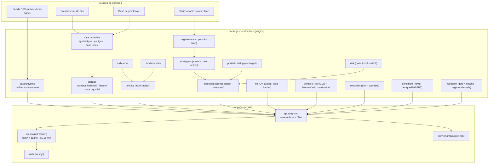

# Quant Terminal — le terminal quant qui publie ce qui **ne marche pas**

[](https://github.com/7noctis7/Screening-Trading/actions/workflows/ci.yml)
[](https://github.com/7noctis7/Screening-Trading/actions/workflows/pages.yml)
[](https://github.com/7noctis7/Screening-Trading/actions/workflows/gitleaks.yml)


> **La plupart des projets quant vendent un alpha imaginaire. Celui-ci prouve statistiquement
> ce qui ne marche pas — et le publie.** Screening & trading systématique multi-actifs (actions,
> ETF, forex, crypto, commodités), méthodologie niveau institutionnel (López de Prado), 100 %
> open-source, **infra 0 €**, **paper par défaut**.

**🌐 Démo live :** **https://7noctis7.github.io/Screening-Trading/** — PWA Next.js reconstruite
chaque jour ouvré par GitHub Actions sur données réelles (yfinance / SEC EDGAR). Poste éteint, 0 €.

> ⚠️ Aide à la décision — **pas un conseil en investissement**. Risque de perte en capital.
> Priorités : **robustesse & reproductibilité > risque > alpha > produit**.

---

## Ce qui rend ce projet différent

- **🔬 Gate d'honnêteté à 4 étages** — aucune stratégie n'entre en production sans passer
  *placebo → Deflated Sharpe → PBO/CSCV → sabotage adverse*. Les hypothèses rejetées sont
  **publiées** dans le [Registre des échecs](https://7noctis7.github.io/Screening-Trading/echecs).
- **📉 Edge honnête** : DSR ≈ 0 assumé (**aucun alpha directionnel prouvé**). Le seul edge
  vérifié est la **réduction du drawdown**. Donnée absente → `n/d`, jamais inventée ; mesure
  trop maigre → `UNCALIBRATED`, jamais extrapolée.
- **🛡️ Rigueur anti-fuite** : point-in-time partout (vintages macro réels, prix ajustés des
  splits), validation croisée purgée et embargoée, verrous de non-régression testés.
- **⚖️ Garde-fous qui se mesurent eux-mêmes** : la convention la plus importante du dépôt est
  que **tout garde-fou publie son compteur de déclenchements**. Un filet dont on ne voit pas
  les prises n'est pas un filet.
- **🔎 Certification** : `make certification` compare ce qu'un module **déclare** de son statut
  à ce qui est **réellement atteignable** depuis la production. Un module qui ment est bloquant.
- **🤖 Exécution paper réelle** : réconciliation idempotente vers un courtier paper, journal
  des trades avec les features **figées à la décision** + allers-retours PnL/MFE/MAE → verdict
  GO/NO-GO **mécanique**.

---

## 📐 Repères chiffrés

| | |
|---|---:|
| Modules métier (`packages/`) | **381** fichiers, **29** sous-domaines |
| Tests | **2 475** passés, 7 ignorés · **351** fichiers de test |
| Décisions d'architecture consignées (ADR) | **129** |
| Routes API | **41** |
| Écrans du front | **28** pages, **44** composants |
| Scripts CLI | **121** |
| Commandes `make` documentées | **125** |
| Fichiers de configuration YAML | **13** |

Discipline de taille imposée et vérifiée par un hook : **< 400 lignes par fichier, < 50 par
fonction**. Une nouvelle stratégie, source ou indicateur = **un fichier auto-enregistré**,
jamais une modification du cœur.

---

## 🗺️ Architecture


```mermaid
flowchart TD
  subgraph SRC["Sources de données"]
    SEED["Seeds CSV (univers hors-ligne)"]; YF["Fournisseurs de prix"]
    LOCAL["Base de prix locale"]; MACRO["Séries macro point-in-time"]
  end
  subgraph CORE["packages/ — domaine (plugins)"]
    UNIV["data.universe<br/>builder multi-sources"]
    PROV["data.providers<br/>synthétique · en ligne · base locale"]
    STORE["storage<br/>bronze/silver/gold · feature store · qualité"]
    IND["indicators"]; FUND["fundamentals"]; RANK["ranking (multi-facteur)"]
    REG["regime (macro point-in-time)"]; STRAT["strategies (preset · cœur indiciel)"]
    SIZE["portfolio.sizing (vol-target)"]; RISK["risk (portail + kill-switch)"]
    BT["backtest (journal discret parts/cash)"]; EXEC["execution (Sim · courtiers)"]
    ML["ml (CV purgée, triple-barrier)"]; PORT["portfolio (VaR/CVaR · Monte-Carlo · attribution)"]
    SENT["sentiment (news · lexique/FinBERT)"]; RES["research (gate 4 étages · registre d'essais)"]
  end
  subgraph APP["apps/ — produit"]
    SNAP["api.snapshot<br/>assemble tout l'état"]
    API["api.main (FastAPI)<br/>/api/* + cache TTL 15 min"]
    WEB["web (Next.js)"]; PREV["preview/interactive.html"]
  end
  SEED --> UNIV; YF --> PROV; LOCAL --> PROV; MACRO --> REG
  UNIV --> SNAP; PROV --> STORE --> SNAP
  IND & FUND --> RANK --> SNAP
  REG --> STRAT --> BT --> SNAP
  SIZE & RISK --> BT
  ML --> SNAP; PORT --> SNAP; EXEC --> SNAP; SENT --> SNAP; RES --> SNAP
  SNAP --> API --> WEB
  SNAP --> PREV
```

**Pipeline** : `données → régime macro → screening/ranking + ML → preset (qualité ·
risk-parity ERC · DD-target) + cœur indiciel → sizing vol-target → portail de risque
(veto/kill-switch) → backtest discret (parts/cash, net de frais) → portefeuille (perf,
VaR/CVaR, Monte-Carlo) → API → terminal web`.

Les interfaces **backtest ↔ paper ↔ live sont les mêmes** : c'est ce qui rend la parité
vérifiable au lieu d'être promise.

| Dossier | Rôle |
|---|---|
| `packages/` | Cœur métier en plugins (indicateurs, stratégies, risque, ML, portefeuille, sentiment, recherche…) |
| `apps/api/` | FastAPI : `snapshot.py` assemble l'état, `main.py` expose `/api/*` (cache TTL 15 min) |
| `apps/web/` | Front Next.js + preview autonome en un fichier |
| `config/` | YAML (univers, facteurs, risque, macro, screening…) |
| `scripts/` | ETL, diagnostics, bancs de mesure, démos |
| `tests/` | Miroir de `packages/` + tests de propriété |
| `vault/` | Mémoire longue du projet (Obsidian) : index, architecture, décisions, journal, TODO |
| `docs/` | Cartes, audits, roadmap, **[référence des commandes](docs/COMMANDES.md)** |

> 🧠 `CLAUDE.md` (racine) et [`AGENTS.md`](AGENTS.md) décrivent le contexte et les règles pour
> un agent IA. La mémoire long-terme vit dans `vault/`.

---

## 🖥️ Les écrans

| Route | Rôle |
|---|---|
| `/` | Landing : le gate en 4 étages, manifeste, ticker live |
| `/dashboard` | Equity + underwater synchronisés, indicateurs clés, régime |
| `/positions` | **Réel vs cible** : écart de réplication, HHI / N effectif, **courbe du portefeuille contre indices de référence** |
| `/analyse-portefeuille` | Importez **votre** portefeuille : risque, scénarios, et **pouls sentiment pondéré par vos poids** |
| `/screener` | Entonnoir de sélection + score **explicable** (z-scores factoriels par titre) |
| `/conviction` | Score de conviction décomposé par contribution |
| `/crypto` | Cockpit crypto : jauge de sentiment, multi-timeframe, carnet, analyse |
| `/echecs` | **Registre des résultats négatifs** — les hypothèses rejetées, publiées |
| `/methode` | La méthode : placebo → DSR → PBO → sabotage |
| `/risk` | VaR/EVT/GARCH, backtest de VaR, ACP, budget de risque, limites, stress, HRP/ERC |
| `/portfolio` | Monte-Carlo, attribution, revue experte |
| `/journal` `/trades` | Journal des allers-retours · ordres exécutés **et** en attente |
| `/ml` | Signaux du modèle, dérive, historique d'entraînement |
| `/fundamentals` `/notes` `/fiche` | DCF, ratios, Piotroski, Altman Z · notes d'analyse par société |
| `/sentiment` | Ton des actualités par position, macro et marché |
| `/events` | Résultats trimestriels à venir (estimés et annoncés) + introductions en bourse |
| `/macro` `/themes` `/universe` `/data` | Régimes macro · secteurs · univers · qualité des données |
| `/investors` `/live` `/profil` `/accueil` `/glossaire` | Actionnariat · mode live · profil investisseur · pédagogie |

**Installable (PWA)** : sur le site en ligne, *Partager → Sur l'écran d'accueil*. ⌘K · thème
clair/sombre · tables triables · graphiques chandeliers au clic.

---

## 🔌 L'API

FastAPI, **verrouillée sur la boucle locale par défaut**, cache TTL 15 min.

**Lecture (`GET`)** — `/health` · `/api/meta` `/api/dashboard` `/api/screener` `/api/screen`
`/api/conviction` `/api/universe` `/api/themes` `/api/macro` `/api/events` `/api/data`
`/api/ml` `/api/sentiment` `/api/fundamentals` `/api/company_report` `/api/notes`
`/api/note_file` `/api/investors` `/api/crypto_cockpit` `/api/ticker` `/api/failures`
`/api/portfolio` `/api/positions` `/api/performance` `/api/trades` `/api/journal`
`/api/preset_ledger` `/api/analytics` `/api/live` `/api/profil` `/api/overlays`
`/api/object/{type}/{id}` · `/api/ai/status` `/api/ai/metrics` `/api/ai/commentary`
`/api/ai/diagnostic`

**Écriture (`POST`, locale uniquement)** — `/api/portfolio/analyze` ·
`/api/portfolio/recommend` · `/api/portfolio/sentiment` · `/api/ai/chat` · `/api/tv/webhook`

Les trois routes `/api/portfolio/*` sont **read-only par contrat** : elles calculent et ne
persistent rien. Un portefeuille de passage n'écrit jamais dans l'historique du robot.

---

## 🚀 Démarrage

### Poste de travail

```bash
uv venv && source .venv/bin/activate
uv pip install -e ".[dev,quant,ml,reporting]"
make test                                       # 2 475 tests

make start                                      # API + front → http://localhost:3000
make stop                                       # arrêt
```

Ou en deux fenêtres, pour voir les deux journaux :

```bash
make api      # → http://localhost:8000
make web      # → http://localhost:3000
```

**Sans rien installer** : `python apps/web/preview/build_interactive.py` génère un fichier
HTML autonome à ouvrir directement.

### Serveur permanent (systemd)

Sur une machine qui doit survivre à la déconnexion SSH :

```bash
make services     # installe l'API et le front en services systemd (une fois)
make up           # sync + relance + attente que le front réponde
make services-logs
```

> `make start` **refuse** de démarrer quand les services tournent, plutôt que d'entrer en
> conflit sur le port. Le front tourne alors en mode production, pas en serveur de
> développement : ce dernier supporte mal d'être un service au long cours.

### Toutes les commandes

**→ [`docs/COMMANDES.md`](docs/COMMANDES.md)** — les 125 cibles, groupées par intention, avec
les variables d'environnement. En ligne de commande : `make help`.

---

## 📈 Brancher vos données réelles

Le projet utilise une **vraie base si elle existe**, sinon un jeu synthétique — et il affiche
toujours lequel des deux (**mode des données** : réel / mixte / synthétique).

```bash
export QUANT_PRICE_DB="/chemin/vers/votre/base.db"     # adaptez le chemin
make api

python scripts/ingest_prices.py --since 2015-01-01     # backfill complet
python scripts/ingest_prices.py --daily                # incrémental quotidien
make audit                                             # complétude · exactitude · point-in-time
```

Détails : [`docs/REAL_DATA.md`](docs/REAL_DATA.md).

**Biais du survivant** : l'univers ne contient que les titres *encore cotés*. Pour des
backtests longs honnêtes, `make ingest-delisted` alimente la liste des délistés — et l'audit
correspondant s'affiche dans l'écran Données.

---

## 🤖 Exécution paper

```bash
make live          # APERÇU : affiche les ordres cibles, n'envoie RIEN
make live-go       # EXÉCUTE en paper — clés requises
```

**Trois conditions cumulatives** pour qu'un ordre parte : `--live` **ET** `--yes` **ET** des
clés présentes. Si l'une manque, le moteur retombe en aperçu. Le courtier actions est **forcé
en paper dans le code**, et toute place crypto réelle est neutralisée par défaut.

```
BACKTEST              PAPER                    LIVE
make backtest-*   →   make live-go        →    NON ACTIVÉ
aucun ordre           courtier paper           décision humaine explicite requise
```

L'activation d'un courtier réel est conditionnée à un rendez-vous d'évaluation daté et à une
décision explicite du propriétaire. **Aucun agent ne peut la déclencher.**

### Courtier tiers — compte démo uniquement

Trois verrous indépendants, un seul suffit pour refuser : le **port** (les ports réels sont
rejetés avant toute connexion), l'**identifiant de compte** lu *après* connexion (tout ce qui
n'est pas un préfixe démo est refusé, **y compris un identifiant vide**), et un **opt-in
explicite**. L'identifiant est re-contrôlé **avant chaque ordre**, parce qu'une passerelle
peut être relancée sur un autre compte pendant que le processus tourne. Il n'existe aucun
paramètre qui ouvrirait le réel : en ajouter un exigerait de modifier le code source — un
geste visible, revu, tracé. Un test le vérifie.

---

## 🛡️ Gestion du risque

Le portail pré-trade s'insère **après la stratégie et avant le courtier**. Il ne connaît rien
de la stratégie : il ne voit qu'un ordre, un état de compte, et des limites lues **dans
l'environnement seul**. C'est ce qui le rend non contournable.

| Variable | Défaut | Effet |
|---|---:|---|
| `QUANT_RISK_MAX_WEIGHT` | `0.20` | une ligne ne dépasse pas 20 % du compte |
| `QUANT_RISK_MAX_POSITIONS` | `40` | au-delà, plus aucune ouverture |
| `QUANT_RISK_MAX_ORDER_PCT` | `0.15` | un ordre ne dépasse pas 15 % du compte |
| `QUANT_RISK_MAX_GROSS` | `1.00` | **aucun levier, jamais** |
| `QUANT_MIN_POSITION` | `1000` | plancher de ligne |

Deux principes encodés et testés :

1. **Le portail ne peut que réduire ou refuser, jamais augmenter.**
2. **Un désengagement n'est jamais bloqué** — même compte saturé, même equity illisible. Un
   portail qui refuse une vente augmente le risque au lieu de le réduire.

S'y ajoutent des kill-switches indépendants (drawdown intraday, coupe-circuit sur la perte du
jour, alertes techniques externes). Chacun peut ramener l'exposition à zéro.

**L'IA n'est pas dans la chaîne d'ordres.** Le module de langage n'est importé que par les
endpoints de génération de texte ; le module d'intelligence de marché n'importe ni
l'exécution ni le risque, et un test le vérifie **sur l'arbre syntaxique** à chaque exécution
de la suite.

---

## 🛰️ Qualification de l'information

`packages/intelligence` qualifie l'information de marché avant qu'elle n'atteigne l'analyse :

```
source → authentification → score de source → nature (fait/opinion/rumeur)
       → corroboration croisée → pertinence → statut + confiance
```

Règles encodées : une **opinion ne devient jamais un fait** ; le **nombre d'abonnés** vaut au
maximum 0,08 sur 1,00 ; un compte **non authentifié** est plafonné à 0,60 ; les niveaux les
plus bas **ne confirment jamais** ; les **reprises d'une même origine** comptent pour une
seule ; l'exigence de corroboration **croît avec l'impact** (1 / 2 / 3 sources indépendantes).

**État : architecture complète et testée, aucun collecteur.** Il n'y a ni flux, ni
persistance. C'est le premier livrable attendu de cette couche — et le dire vaut mieux que
laisser croire qu'elle tourne.

---

## 📊 État du projet

| Niveau | Verdict |
|---|---|
| **CODE READY** | ✅ oui — 2 475 tests passent, gates CI verts |
| **PAPER TRADING READY** | ⚠️ en cours — le rebalancement paper tourne et le journal est vérifié (`make verify-journal`), mais **P0-3 reste ouvert** ([`docs/ROADMAP.md`](docs/ROADMAP.md)) |
| **LIVE TRADING READY** | ❌ non — et ce n'est pas une question de code |

Audits détaillés : [`docs/PROJECT_AUDIT.md`](docs/PROJECT_AUDIT.md) ·
[`docs/AUDIT_SITE.md`](docs/AUDIT_SITE.md) · [`docs/TEST_REPORT.md`](docs/TEST_REPORT.md).

## ⚠️ Limites connues

Ce que ce projet **ne** sait **pas** faire, écrit ici plutôt que découvert plus tard :

1. **Aucun alpha directionnel prouvé.** Le DSR multi-essais est ≈ 0 et c'est assumé. Le seul
   edge vérifié porte sur la réduction du drawdown.
2. **Le coût du turnover n'est pas instrumenté.** Les colonnes frais et slippage existent au
   journal mais ne sont pas alimentées par le chemin d'exécution : `make turnover-audit`
   rapporte donc `0,00 $` de coût, ce qui est un champ vide, pas une mesure.
3. **Aucune sortie n'est déclenchée par un stop ou un objectif** — toute clôture vient du
   rebalancement. La capture médiane du potentiel mesurée est négative.
4. **Échantillon de décisions réelles encore trop maigre** pour distinguer un effet du bruit.
   Les mesures qui le concernent renvoient `UNCALIBRATED` au lieu d'un chiffre rassurant.
5. **La bande d'inaction n'est pas instruite** (P0-3) : à 3 % en poids absolu, elle bloque
   99 % des pas alors qu'une position pèse ~3,3 % — la bande vaut presque une ligne entière.
   Une bande **relative** au poids cible reste à mesurer ; le labo doit trancher, pas l'intuition.
6. **Dette de câblage** : des modules écrits et testés ne sont pas atteignables depuis la
   production. `make certification` la chiffre et refuse qu'un module mente sur son statut.

Liste priorisée : [`docs/ROADMAP.md`](docs/ROADMAP.md) et `vault/03_TODO.md`.

---

## 🔐 Sécurité & confidentialité

Dépôt **public**, et traité comme tel :

- **Jamais committés** : `.env`, les bases de données, les caches, les exports du site et les
  données de portefeuille. Tous ignorés par git.
- **Aucun secret dans l'historique** — un scanner de secrets tourne en intégration continue
  **et** en pre-commit.
- **Les positions réelles ne quittent jamais la machine locale.** Le build en ligne n'a pas
  les clés courtier : le site public ne peut structurellement pas les afficher.
- **API verrouillée sur la boucle locale** (`QUANT_CORS_ORIGINS` pour élargir), endpoints en
  écriture protégés par jeton.
- **Aucune donnée personnelle dans le dépôt** : les chemins, adresses et identifiants qui
  apparaissent dans la documentation sont des **placeholders** (`/chemin/vers/…`,
  `utilisateur@<serveur>`), jamais des valeurs réelles.

Voir [`SECURITY.md`](SECURITY.md) · audit du dépôt à la demande : skill `/audit-secrets`.

## 🤝 Contribution

[`CONTRIBUTING.md`](CONTRIBUTING.md). En résumé : `make test` avant tout commit, moins de
400 lignes par fichier et 50 par fonction, une nouvelle stratégie ou source = **un fichier
auto-enregistré** (jamais de modification du cœur), et tout garde-fou publie son compteur.

## 🧭 Pour les agents IA

[`AGENTS.md`](AGENTS.md) — architecture, commandes, fichiers critiques, règles de
modification. `CLAUDE.md` est chargé automatiquement et porte les garde-fous non négociables.

## Licence

MIT.
