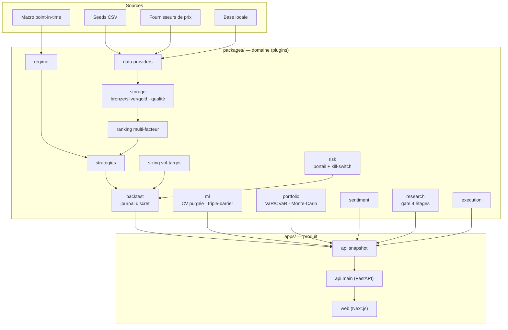

<div align="center">

# Quant Terminal

**Le terminal quant qui publie ce qui ne marche pas.**

Screening & trading systématique multi-actifs — actions, ETF, forex, crypto, commodités.
Méthodologie institutionnelle, 100 % open-source, infra 0 €, **paper par défaut**.

[](https://github.com/7noctis7/Screening-Trading/actions/workflows/ci.yml)
[](https://github.com/7noctis7/Screening-Trading/actions/workflows/gitleaks.yml)


### [→ Voir la démo live](https://7noctis7.github.io/Screening-Trading/)

<sub>PWA reconstruite chaque jour ouvré par GitHub Actions, sur données réelles.</sub>

</div>

> [!WARNING]
> Aide à la décision — **pas un conseil en investissement**. Risque de perte en capital.

---

## Pourquoi ce projet est différent

La plupart des projets quant vendent un alpha imaginaire. Celui-ci **mesure**, et publie le
résultat même quand il est mauvais.

|  |  |
|---|---|
| 🔬 **Gate à 4 étages** | Aucune stratégie n'entre en production sans passer *placebo → Deflated Sharpe → PBO/CSCV → sabotage adverse*. Les rejetées sont publiées dans le [Registre des échecs](https://7noctis7.github.io/Screening-Trading/echecs). |
| 📉 **Edge honnête** | DSR ≈ 0 assumé : **aucun alpha directionnel prouvé**. Le seul edge vérifié est la réduction du drawdown. |
| 🚫 **Rien d'inventé** | Donnée absente → `n/d`. Mesure trop maigre → `UNCALIBRATED`. Jamais un chiffre rassurant à la place d'un trou. |
| ⚖️ **Garde-fous visibles** | Règle n°1 du dépôt : **tout garde-fou publie son compteur de déclenchements**. Un filet dont on ne voit pas les prises n'est pas un filet. |

---

## En chiffres

| Code | | Produit | |
|---|---:|---|---:|
| Modules métier | **381** | Routes API | **41** |
| Fichiers de test | **351** | Écrans | **28** |
| Tests au vert | **2 475** | Composants front | **44** |
| Décisions consignées (ADR) | **129** | Commandes `make` | **125** |

<sub>Discipline vérifiée par un hook : **< 400 lignes/fichier, < 50/fonction**. Une nouvelle
stratégie, source ou indicateur = **un fichier auto-enregistré**, jamais une modification du cœur.</sub>

---

## Démarrage

```bash
uv venv && source .venv/bin/activate
uv pip install -e ".[dev,quant,ml,reporting]"
make test          # 2 475 tests

make start         # API + front → http://localhost:3000
```

<details>
<summary><b>Autres modes de lancement</b></summary>

<br>

**En deux fenêtres**, pour voir les deux journaux :

```bash
make api      # → http://localhost:8000
make web      # → http://localhost:3000
```

**Sans rien installer** — un fichier HTML autonome :

```bash
python apps/web/preview/build_interactive.py
```

**Serveur permanent** (systemd), pour survivre à la déconnexion SSH :

```bash
make services      # installe l'API et le front en services (une fois)
make up            # sync + relance + attente que le front réponde
make services-logs
```

`make start` **refuse** de démarrer quand les services tournent, plutôt que d'entrer en conflit
sur le port. Le front passe alors en mode production : un serveur de développement supporte mal
d'être un service au long cours.

</details>

**Toutes les commandes** → **[`docs/COMMANDES.md`](docs/COMMANDES.md)** (125 cibles groupées par
intention) · ou `make help`.

---

## Ce que vous voyez

| | Écrans |
|---|---|
| **Décider** | `/dashboard` equity & régime · `/screener` score explicable · `/conviction` · `/ml` |
| **Votre argent** | `/positions` réel vs cible + courbe contre indices · `/analyse-portefeuille` importez le vôtre · `/portfolio` · `/journal` `/trades` |
| **Risque** | `/risk` VaR/EVT/GARCH, stress, HRP/ERC, budget de risque, limites |
| **Comprendre** | `/echecs` **les hypothèses rejetées** · `/methode` le gate · `/accueil` `/glossaire` |
| **Contexte** | `/sentiment` · `/events` · `/macro` `/themes` · `/crypto` · `/fundamentals` `/notes` · `/universe` `/data` |

<sub>Installable en PWA · thème clair/sombre · ⌘K · graphiques chandeliers au clic.</sub>

---

## Comment ça marche

```
données → régime macro → screening + ML → preset (qualité · risk-parity · DD-target) + cœur indiciel
        → sizing vol-target → portail de risque → backtest discret net de frais → API → terminal
```

**Les interfaces backtest ↔ paper ↔ live sont les mêmes.** C'est ce qui rend la parité
vérifiable au lieu d'être promise.

<details>
<summary><b>Schéma d'architecture</b></summary>

<br>


```mermaid
flowchart TD
  subgraph SRC["Sources"]
    SEED["Seeds CSV"]; YF["Fournisseurs de prix"]
    LOCAL["Base locale"]; MACRO["Macro point-in-time"]
  end
  subgraph CORE["packages/ — domaine (plugins)"]
    PROV["data.providers"]; STORE["storage<br/>bronze/silver/gold · qualité"]
    RANK["ranking multi-facteur"]; REG["regime"]; STRAT["strategies"]
    SIZE["sizing vol-target"]; RISK["risk<br/>portail + kill-switch"]
    BT["backtest<br/>journal discret"]; EXEC["execution"]
    ML["ml<br/>CV purgée · triple-barrier"]; PORT["portfolio<br/>VaR/CVaR · Monte-Carlo"]
    SENT["sentiment"]; RES["research<br/>gate 4 étages"]
  end
  subgraph APP["apps/ — produit"]
    SNAP["api.snapshot"]; API["api.main (FastAPI)"]; WEB["web (Next.js)"]
  end
  SEED & YF & LOCAL --> PROV --> STORE --> RANK
  MACRO --> REG --> STRAT --> BT
  RANK --> STRAT; SIZE & RISK --> BT
  BT & ML & PORT & SENT & RES & EXEC --> SNAP --> API --> WEB
```

| Dossier | Rôle |
|---|---|
| `packages/` | Cœur métier en plugins — indicateurs, stratégies, risque, ML, portefeuille, sentiment, recherche |
| `apps/api/` | FastAPI : `snapshot.py` assemble l'état, `main.py` expose `/api/*` (cache 15 min) |
| `apps/web/` | Front Next.js + preview autonome |
| `config/` · `scripts/` | YAML de configuration · ETL, diagnostics, bancs de mesure |
| `tests/` · `vault/` · `docs/` | Miroir de `packages/` · mémoire longue du projet · cartes et audits |

</details>

<details>
<summary><b>Les 41 routes de l'API</b></summary>

<br>

FastAPI, **verrouillée sur la boucle locale par défaut**, cache TTL 15 min.

**Lecture** — `/health` · `/api/` + `meta` `dashboard` `screener` `screen` `conviction`
`universe` `themes` `macro` `events` `data` `ml` `sentiment` `fundamentals` `company_report`
`notes` `note_file` `investors` `crypto_cockpit` `ticker` `failures` `portfolio` `positions`
`performance` `trades` `journal` `preset_ledger` `analytics` `live` `profil` `overlays`
`object/{type}/{id}` `ai/status` `ai/metrics` `ai/commentary` `ai/diagnostic`

**Écriture** (locale uniquement) — `/api/portfolio/analyze` · `/api/portfolio/recommend` ·
`/api/portfolio/sentiment` · `/api/ai/chat` · `/api/tv/webhook`

Les trois routes `/api/portfolio/*` sont **read-only par contrat** : elles calculent et ne
persistent rien. Un portefeuille de passage n'écrit jamais dans l'historique du robot.

</details>

---

## Brancher vos données

Le projet utilise une **vraie base si elle existe**, sinon un jeu synthétique — et il affiche
toujours lequel des deux.

```bash
export QUANT_PRICE_DB="/chemin/vers/votre/base.db"
python scripts/ingest_prices.py --since 2015-01-01   # backfill
python scripts/ingest_prices.py --daily              # quotidien
make audit                                           # complétude · exactitude · point-in-time
```

Détails : [`docs/REAL_DATA.md`](docs/REAL_DATA.md) · anti-biais du survivant :
`make ingest-delisted`.

---

## Exécution paper

```bash
make live       # APERÇU : affiche les ordres cibles, n'envoie RIEN
make live-go    # EXÉCUTE en paper — clés requises
```

> [!IMPORTANT]
> **Trois conditions cumulatives** pour qu'un ordre parte : `--live` **et** `--yes` **et** des
> clés présentes. Si l'une manque, le moteur retombe en aperçu. Le courtier actions est **forcé
> en paper dans le code** ; toute place crypto réelle est neutralisée par défaut.

```
BACKTEST              PAPER                    LIVE
make backtest-*   →   make live-go        →    NON ACTIVÉ
aucun ordre           courtier paper           décision humaine explicite requise
```

L'activation d'un courtier réel est conditionnée à un rendez-vous d'évaluation daté et à une
décision explicite du propriétaire. **Aucun agent ne peut la déclencher.**

<details>
<summary><b>Courtier tiers : les trois verrous du compte démo</b></summary>

<br>

Un seul suffit pour refuser :

1. **Le port** — les ports réels sont rejetés avant toute connexion.
2. **L'identifiant de compte**, lu *après* connexion — tout ce qui n'est pas un préfixe démo est
   refusé, **y compris un identifiant vide**. Re-contrôlé **avant chaque ordre**, parce qu'une
   passerelle peut être relancée sur un autre compte pendant que le processus tourne.
3. **Un opt-in explicite** par variable d'environnement.

Il n'existe aucun paramètre qui ouvrirait le réel : en ajouter un exigerait de modifier le code
source — un geste visible, revu, tracé. Un test le vérifie.

</details>

---

## Gestion du risque

Le portail pré-trade s'insère **après la stratégie et avant le courtier**. Il ne connaît rien de
la stratégie : il ne voit qu'un ordre, un état de compte, et des limites lues **dans
l'environnement seul**. C'est ce qui le rend non contournable.

| Limite | Défaut |
|---|---:|
| Poids maximum d'une ligne | `20 %` |
| Nombre maximum de positions | `40` |
| Taille maximum d'un ordre | `15 %` du compte |
| Exposition brute | `100 %` — **aucun levier, jamais** |
| Plancher de ligne | `1 000 $` |

**Deux principes encodés et testés :**

1. Le portail ne peut que **réduire ou refuser**, jamais augmenter.
2. **Un désengagement n'est jamais bloqué** — même compte saturé, même equity illisible. Un
   portail qui refuse une vente augmente le risque au lieu de le réduire.

S'y ajoutent des kill-switches indépendants — drawdown intraday, coupe-circuit sur la perte du
jour, alertes externes. Chacun peut ramener l'exposition à zéro.

> [!NOTE]
> **L'IA n'est pas dans la chaîne d'ordres.** Le module de langage n'est importé que par les
> endpoints de génération de texte ; le module d'intelligence de marché n'importe ni l'exécution
> ni le risque — et un test le vérifie **sur l'arbre syntaxique** à chaque exécution de la suite.

<details>
<summary><b>Qualification de l'information de marché</b></summary>

<br>

```
source → authentification → score de source → nature (fait/opinion/rumeur)
       → corroboration croisée → pertinence → statut + confiance
```

Règles encodées : une **opinion ne devient jamais un fait** ; le **nombre d'abonnés** vaut au
maximum 0,08 sur 1,00 ; un compte **non authentifié** plafonne à 0,60 ; les niveaux les plus bas
**ne confirment jamais** ; les reprises d'une même origine comptent pour **une seule** ;
l'exigence de corroboration **croît avec l'impact** (1 / 2 / 3 sources indépendantes).

**État : architecture complète et testée, aucun collecteur.** Ni flux, ni persistance. C'est le
premier livrable attendu de cette couche — et le dire vaut mieux que laisser croire qu'elle tourne.

</details>

---

## Où en est le projet

| | |
|---|---|
| **Code** | ✅ 2 475 tests au vert, gates CI verts |
| **Paper trading** | ⚠️ tourne, journal vérifié — mais **P0-3 reste ouvert** |
| **Live trading** | ❌ non, et ce n'est pas une question de code |

### Ce que le projet ne sait pas faire

Écrit ici plutôt que découvert plus tard.

1. **Aucun alpha directionnel prouvé.** DSR multi-essais ≈ 0, assumé.
2. **Le coût du turnover n'est pas instrumenté.** Les colonnes frais et slippage existent au
   journal mais l'exécution ne les alimente pas : l'audit rapporte `0,00 $`, ce qui est un champ
   vide, pas une mesure.
3. **Aucune sortie par stop ou objectif** — toute clôture vient du rebalancement, et la capture
   médiane du potentiel mesurée est négative.
4. **Échantillon de décisions réelles trop maigre** pour distinguer un effet du bruit. Les
   mesures concernées renvoient `UNCALIBRATED`.
5. **La bande d'inaction n'est pas instruite** (P0-3) : à 3 % en poids absolu elle bloque 99 %
   des pas, alors qu'une position pèse ~3,3 %.
6. **Dette de câblage** — des modules testés ne sont pas atteignables depuis la production.
   `make certification` la chiffre et refuse qu'un module mente sur son statut.

Liste priorisée : [`docs/ROADMAP.md`](docs/ROADMAP.md).

---

## Sécurité & confidentialité

Dépôt **public**, et traité comme tel :

- **Jamais committés** : `.env`, bases de données, caches, exports, données de portefeuille.
- **Aucun secret dans l'historique** — scanner en intégration continue **et** en pre-commit.
- **Les positions réelles ne quittent jamais la machine locale.** Le build en ligne n'a pas les
  clés courtier : le site public ne peut structurellement pas les afficher.
- **API verrouillée** sur la boucle locale ; endpoints en écriture protégés par jeton.
- **Aucune donnée personnelle** : les chemins et adresses de la documentation sont des
  placeholders, jamais des valeurs réelles.

---

## Aller plus loin

| | |
|---|---|
| [`docs/COMMANDES.md`](docs/COMMANDES.md) | Les 125 commandes, groupées par intention |
| [`docs/ROADMAP.md`](docs/ROADMAP.md) | Priorités P0 → P3, avec difficulté et risques |
| [`docs/REAL_DATA.md`](docs/REAL_DATA.md) | Brancher vos propres données |
| [`docs/PROJECT_AUDIT.md`](docs/PROJECT_AUDIT.md) · [`docs/AUDIT_SITE.md`](docs/AUDIT_SITE.md) | Audits architecture et produit |
| [`CONTRIBUTING.md`](CONTRIBUTING.md) · [`SECURITY.md`](SECURITY.md) | Contribuer · signaler une faille |
| [`AGENTS.md`](AGENTS.md) | Contexte et règles pour un agent IA |

<div align="center">
<sub>MIT · <a href="https://7noctis7.github.io/Screening-Trading/">démo live</a></sub>
</div>
