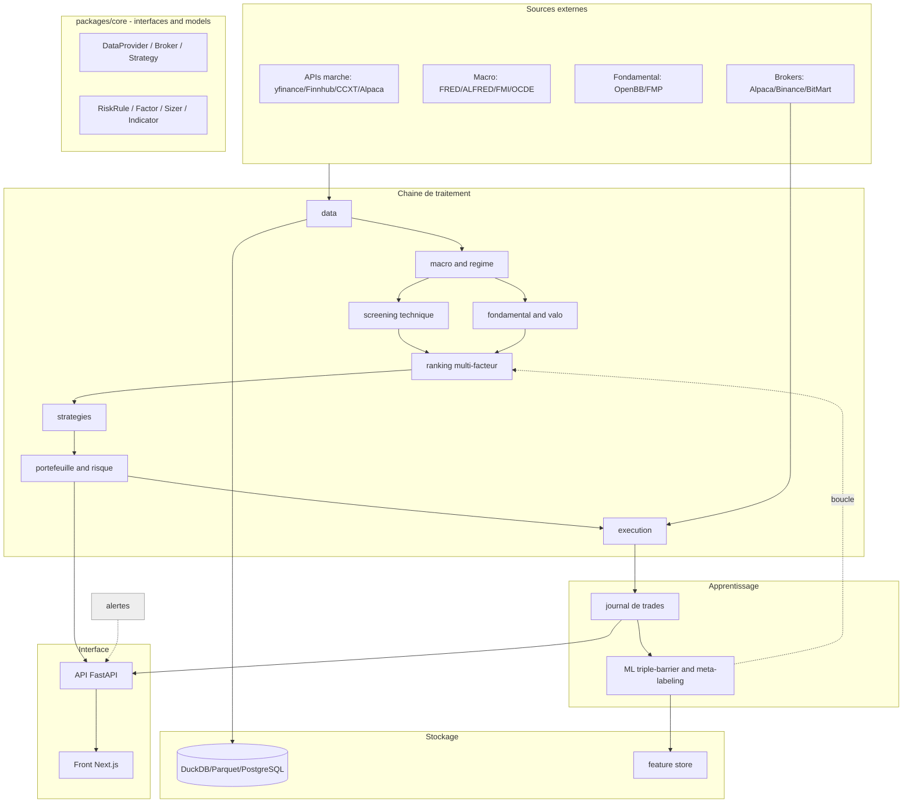
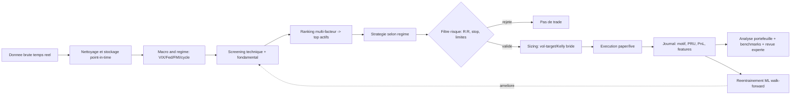

# 01 — ARCHITECTURE (schéma vivant)

> **Source de vérité.** Ce schéma reflète l'état réel du code. S'ils divergent,
> **le code a raison** → corriger le schéma immédiatement. Miroir Notion synchronisé,
> Obsidian fait foi.

## Conventions
- **1 responsabilité / fichier**. Plafond : < 400 lignes/fichier, < 50 lignes/fonction.
- **Dépendre d'abstractions** (`packages/core/interfaces.py`), jamais des implémentations.
- **Plugins auto-enregistrés** via `Registry` (`packages/core/registry.py`).
- **Config-driven** (YAML dans `config/`), **injection de dépendances** explicite, pas d'état global.
- **Event bus** interne (`packages/common/event_bus.py`) : un signal émis ≠ appel direct à l'exécution.
- **Point-in-time** obligatoire pour macro & fondamentaux.

## Couches (Clean / Hexagonal)
`core` (domaine pur, zéro dépendance) ← `adapters` (data/execution/storage) ← `apps` (api/web).
Le domaine ne dépend **jamais** de l'API, la DB ou l'UI.

---

## Diagramme 1 — Architecture (composants & couches)

## Diagramme 2 — Flux de fonctionnement (bout en bout)

---

## État d'implémentation (mis à jour à chaque session)
| Module | Package | État |
|---|---|---|
| Core (interfaces + models + registry) | `packages/core` | ✅ posé (session 0) |
| Common (config/log/event bus) | `packages/common` | ✅ posé (session 0) |
| Data providers + univers | `packages/data` | ✅ +yfinance/FMP/wrappers/DuckDB (S6) |
| Indicateurs | `packages/indicators` | ✅ 8 indicateurs (S1) |
| Storage (bronze/silver/gold) | `packages/storage` | ✅ bronze/silver/GOLD feature store (S5) |
| Macro & régime | `packages/regime` | ✅ point-in-time vintages + cycle + surprises (S7) |
| Fondamental & valo | `packages/fundamentals` | ✅ ratios+DCF+value/quality (S4) |
| Ranking multi-facteur | `packages/ranking` | ✅ momentum/trend/low-vol (S3) |
| Stratégies | `packages/strategies` | ✅ 2 plugins (S1) |
| Backtest | `packages/backtest` | ✅ event-driven + walk-forward + DSR (S5) |
| Risque (engine + règles) | `packages/risk` | ✅ engine+veto+kill-switch (S1) |
| Portefeuille | `packages/portfolio` | 🟡 sizing+métriques (S1) |
| Exécution (paper) | `packages/execution` | ✅ SimBroker+AlpacaBroker+LiveEngine (S8) |
| ML | `packages/ml` | ⬜ à venir (P2) |
| Alertes | `packages/alerts` | ⬜ à venir (P2) |
| Reporting | `packages/reporting` | ⬜ à venir (P2) |
| API / Web | `apps/` | ⬜ à venir (P2) |

> **Test de validation de l'archi** : *« ajouter un exchange / une stratégie /
> un indicateur / un facteur = 1 fichier, sans toucher au reste ».* Couvert par
> `tests/core/test_registry.py`.
